# FIAP - Faculdade de Informática e Administração Paulista
Enterprise Challenge - Sprint 2 - Ingredion

 

# Nome do projeto
🌽 Previsão de Produtividade de Milho (Sorriso-MT) 🌽

## 👨‍🎓 Integrantes: 
- <a href="https://www.linkedin.com/in/bryanjfagundes/">Bryan Fagundes</a>
- <a href="https://br.linkedin.com/in/brenner-fagundes">Brenner Fagundes</a>
- <a href="https://www.linkedin.com/in/diogo-botton-46ba49197/">Diogo Botton</a> 
- <a href="https://www.linkedin.com/in/hyankacoelho/">Hyanka Coelho</a> 
- <a href="https://www.linkedin.com/in/julianahungaro/">Juliana Hungaro Fidelis</a>

## 👩‍🏫 Professores:
### Tutor(a) 
- <a href="https://www.linkedin.com/in/leonardoorabona?utm_source=share&utm_campaign=share_via&utm_content=profile&utm_medium=android_app">Leonardo Ruiz Orabona</a>
### Coordenador(a)
- <a href="https://www.linkedin.com/in/andregodoichiovato/">André Godoi</a>

## 📋 Visão Geral
Este projeto tem como objetivo desenvolver um modelo de Inteligência Artificial (IA) para prever a produtividade agrícola do milho no município de Sorriso, Mato Grosso, Brasil. Utilizando dados históricos de clima, sensoriamento remoto (NDVI) e produtividade, buscamos identificar os fatores mais relevantes e construir um modelo preditivo.

O projeto foi dividido nas seguintes etapas principais:

1.  **Pré-processamento dos Dados:** Coleta, limpeza, tratamento e organização dos dados de diferentes fontes.
2.  **Consolidação e Análise Exploratória:** Junção das bases de dados processadas e análise visual/estatística para identificar padrões e relações.
3.  **Construção do Modelo de IA:** Engenharia de atributos, seleção, treinamento, otimização e avaliação de modelos de Machine Learning.
4.  **Avaliação e Visualização:** Análise detalhada do desempenho do modelo final e criação de um dashboard interativo para visualização dos resultados.

## 📊 Fonte de Dados
* **Dados Climáticos:** Dados horários de estações meteorológicas do INMET (Instituto Nacional de Meteorologia) para a região de Sorriso-MT, abrangendo o período de 2003 a 2025 (com possíveis gaps). Variáveis incluem temperatura, precipitação, radiação solar, umidade relativa e velocidade do vento.
    * *Fonte:* [INMET - Dados Históricos](https://portal.inmet.gov.br/dadoshistoricos) ☀️☁️🌧️☂️🌬️
* **Dados de NDVI:** Série temporal de Índice de Vegetação por Diferença Normalizada (NDVI) obtida a partir de dados do sensor SatVeg para a área de interesse.
    * *Fonte:* [SatVeg  - Dados Históricos](https://www.satveg.cnptia.embrapa.br) 🛰️
* **Dados de Produtividade Agrícola:** Série histórica de área plantada, produção e produtividade para a cultura do milho no estado de Mato Grosso (filtrado para o produto "MILHO"). Inclui informações sobre o ano agrícola e a safra (1ª, 2ª, 3ª).
    * *Fonte:* [CONAB - Série Histórica Grãos](https://portaldeinformacoes.conab.gov.br/downloads/arquivos/SerieHistoricaGraos.txt) 🌽
* **Dados de Solo (Não Utilizado no Modelo Final):** Tentativas foram feitas para extrair dados médios de propriedades físico-químicas do solo (argila, silte, areia, pH, carbono orgânico) para a região usando o dataset SoilGrids via Google Earth Engine. No entanto, devido a problemas de acesso e/ou IDs de assets desatualizados, esses dados não foram incorporados ao modelo final apresentado.

## Etapa 1 - Pré-Processamento de Dados
Nesta etapa, cada fonte de dados foi processada individualmente para limpeza, tratamento e formatação, gerando arquivos CSV intermediários na pasta `dados_processados/`.

* **Clima (INMET):**
    * Carregamento de múltiplos arquivos CSV anuais (`sorriso_*.csv`).
    * Tratamento robusto para lidar com diferentes separadores (`;` ou `,`) e encodings (`latin1` ou `utf-8`).
    * Atribuição programática de nomes de colunas padronizados.
    * Conversão das colunas de data e hora para o formato datetime, combinando-as e tratando diferentes formatos encontrados (`DD/MM/YYYY HH:MM:SS`, `YYYY/MM/DD HHMM`, etc.). Linhas com data/hora inválidas foram removidas.
    * Filtragem dos dados para manter registros a partir do ano **2003**.
    * Criação das colunas `ANO`, `MES` e `ANO_MES`.
    * Conversão das colunas de interesse (Temperatura, Radiação, Precipitação, Umidade Relativa, Velocidade do Vento) para tipo numérico, tratando valores ausentes padrão do INMET (`-9999`) e valores inválidos (ex: radiação negativa).
    * Cálculo das médias diárias para as variáveis principais (`TEMPERATURA_media_diaria`, `RADIACAO_media_diaria`, `UMIDADE_media_diaria`, `VENTO_VEL_media_diaria`). Linhas onde o cálculo da média diária falhou (resultando em NaN) foram removidas.
    * *Saída:* `dados_processados/clima_consolidado.csv`

* **NDVI (SatVeg):**
    * Carregamento do arquivo CSV (`satveg_original.csv`).
    * Conversão da coluna 'Data' para datetime (formato `DD/MM/YYYY`).
    * Criação das colunas `ANO`, `MES`, `AnoMes`.
    * Conversão das colunas `NDVI`, `PreFiltro`, `FlatBottom` para tipo numérico (float), tratando a vírgula como separador decimal. As colunas `PreFiltro`, `FlatBottom` não foram utilizadas no modelo
    * Cálculo da média mensal do NDVI (`NDVI_media_mensal`) para cada combinação Ano-Mês.
    * *Saída:* `dados_processados/satveg_processado.csv`

* **Produtividade (Milho CONAB):**
    * Carregamento do arquivo `serie_historica_graos.csv`.
    * Filtragem para manter apenas registros de Mato Grosso (`uf == 'MT'`) e do produto `MILHO`.
    * Separação da coluna `ano_agricola` (ex: "2014/15") nas colunas numéricas `primeiro_ano` e `segundo_ano`.
    * Renomeação das colunas de área, produção e produtividade para nomes padronizados.
    * Padronização dos nomes na coluna `safra` (ex: "1a Safra" -> "1ª Safra").
    * Filtragem para manter registros a partir do `primeiro_ano` >= 2002.
    * Conversão das colunas numéricas para o tipo correto e tratamento de valores ausentes.
    * Renomeação final de `primeiro_ano` para `ANO` e `produtividade_t_ha` para `Produtividade_Anual`.
    * Seleção das colunas finais relevantes.
    * *Saída:* `dados_processados/milho.csv` (contendo múltiplas linhas por ano, uma para cada safra).

## Etapa 2 - Consolidação e Análise Exploratória
O objetivo desta etapa foi unificar as bases de dados processadas e realizar uma análise inicial para entender os padrões e relações.

* **Consolidação:**
    * Os arquivos `clima_consolidado.csv`, `satveg_processado.csv` e `milho.csv` foram carregados.
    * Foi criada uma base de dados **mensal** (`base_consolidada_mensal.csv`) como principal resultado. Para isso:
        * Os dados climáticos horários/diários foram agregados por `ANO` e `MES` (calculando média para temperatura, radiação, umidade, vento e soma para precipitação).
        * Os dados mensais de NDVI do SatVeg (`NDVI_satveg_mensal`) foram juntados (merge) com a base climática mensal usando `ANO` e `MES`.
        * Os dados de produtividade anual (`Produtividade_Anual` do `df_milho`) foram juntados (merge) usando `ANO`. Isso resultou na repetição do valor de produtividade anual para todos os meses daquele ano correspondente.
          
* **Análise Exploratória (Resultados Principais - Ver Gráficos no App/Notebook):**
    * **Clima:** As séries temporais mensais mostraram a sazonalidade esperada para a região, com períodos mais quentes/secos e mais amenos/chuvosos.
    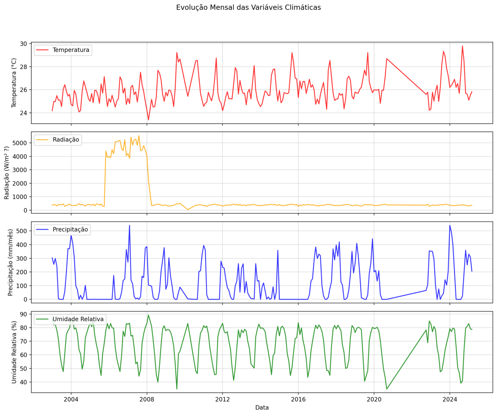

    * **NDVI (SatVeg):** A série temporal do NDVI médio mensal também exibiu forte sazonalidade. O gráfico de "Média Mensal do NDVI" e "Decomposição Série Temporal NDVI Médio Mensal" indicaram que os maiores valores médios de NDVI (pico de vigor vegetativo) ocorrem tipicamente por volta de **Março (Mês 3)**, sugerindo o período crítico para o desenvolvimento da safrinha.
      
  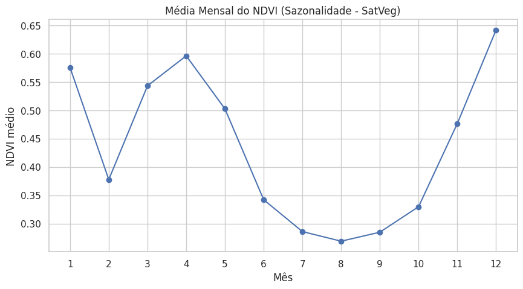

  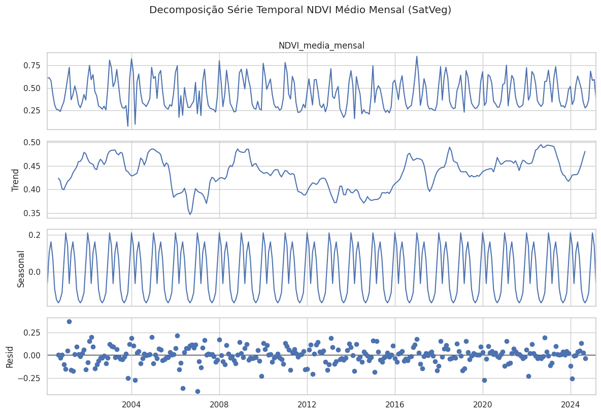
   
    * **Produtividade:** A análise da produtividade por safra mostrou variações significativas entre a 1ª, 2ª e 3ª safras ao longo dos anos, reforçando a importância de analisar os dados por safra. Houve uma tendência geral de aumento da produtividade ao longo dos anos.
      
  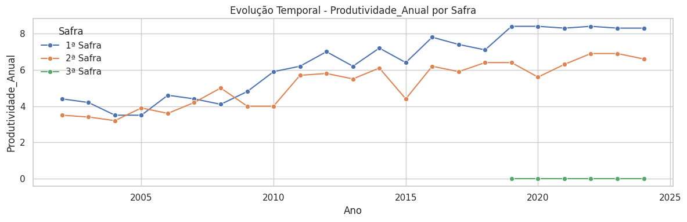

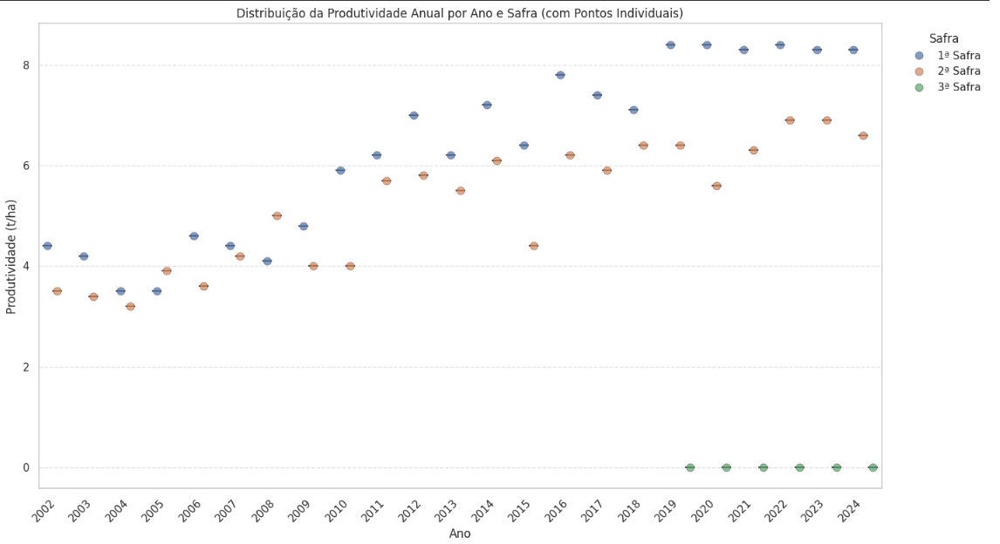

   * **Correlação Mensal:** A matriz de correlação calculada na base mensal consolidada (considerando apenas o período com dados completos para todas as variáveis, 2019-2024) mostrou **correlações lineares fracas** entre a produtividade anual e as médias/somas mensais da maioria das variáveis climáticas e de NDVI. A exceção foi o Vento Médio Mensal, que apresentou correlação negativa moderada (-0.60). Isso indicou que uma simples agregação mensal geral não capturava bem a relação complexa com a produtividade anual.
     
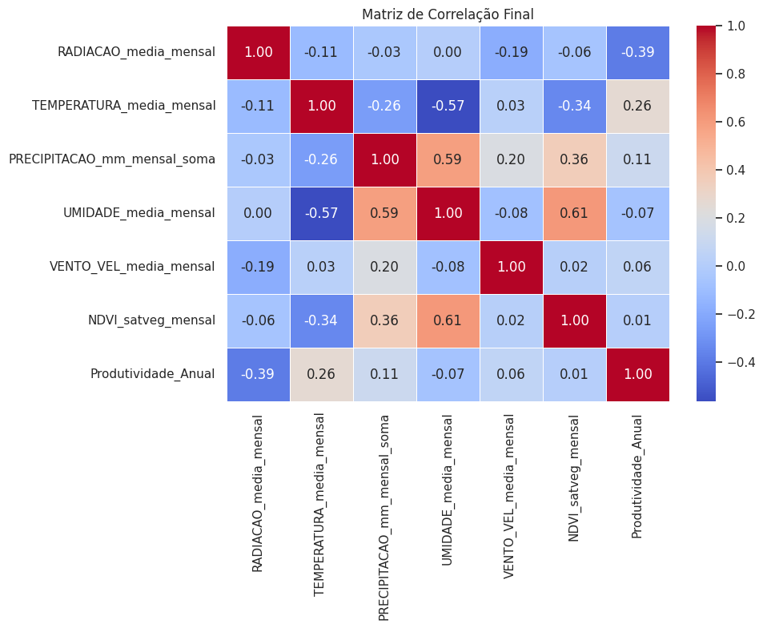

### Segmentação por Limiar Fixo de NDVI (Exemplo: Maio/2024, Limiar > 0.4)

Foi aplicada uma técnica de segmentação simples baseada em um limiar fixo de NDVI para destacar áreas com vegetação potencialmente mais vigorosa em uma imagem de exemplo (Maio de 2024).

* **Método:** Pixels com valor de NDVI **superior a 0.4** foram classificados como "Cultivo Potencial", enquanto pixels com NDVI menor ou igual a 0.4 foram classificados como "Outros". Áreas sem dados foram marcadas como "NoData".
* **Resultado:** A imagem segmentada resultante mostrou extensas áreas classificadas como "Cultivo Potencial", correspondendo visualmente às áreas com maior vigor vegetativo na imagem NDVI original de Maio. Isso é consistente com o período de desenvolvimento do milho safrinha na região.
* **Interpretação:** Esta segmentação básica conseguiu diferenciar áreas com vegetação mais densa (provavelmente a cultura em desenvolvimento) de áreas com menor biomassa (solo exposto, estradas, outras coberturas). O limiar de 0.4 pareceu mais adequado para esta época do ano do que limiares mais altos testados anteriormente.
* **Limitações:** Esta é uma segmentação simples baseada apenas no NDVI. Não diferencia tipos de cultura e pode ser sensível à escolha do limiar e à data da imagem. Técnicas mais avançadas (Otsu, K-Means) poderiam oferecer resultados diferentes.

 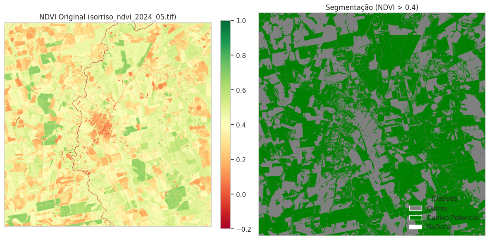

### Segmentação por Limiar Automático (Otsu) (Exemplo: Maio/2024)

Utilizou-se o método de Otsu para determinar automaticamente um limiar ótimo que separasse os pixels da imagem NDVI (Maio de 2024) em duas classes principais, baseando-se na distribuição dos valores de NDVI.

* **Método:** O algoritmo de Otsu analisou o histograma dos valores de NDVI válidos e calculou um limiar de aproximadamente **0.37**. Pixels acima desse limiar foram classificados como "Alto NDVI" e abaixo como "Baixo NDVI".
* **Resultado:** A imagem segmentada mostrou uma classificação semelhante à do limiar fixo de 0.4, mas com o limiar ligeiramente mais baixo (0.37), potencialmente incluindo áreas com vigor vegetativo um pouco menor na classe "Alto NDVI". As áreas verdes ("Alto NDVI") correspondem às regiões com maior atividade fotossintética na imagem original.
* **Interpretação:** O método de Otsu forneceu uma separação automática entre áreas de maior e menor atividade vegetal. O limiar encontrado (0.37) é plausível para diferenciar a vegetação mais desenvolvida (provavelmente milho safrinha em Maio) das demais áreas (solo, estradas, vegetação menos densa) com base puramente na distribuição estatística dos dados daquela imagem específica.
* **Vantagens/Limitações:** A vantagem é a automatização, não exigindo a escolha manual de um limiar. A limitação é que o limiar ótimo estatisticamente pode não corresponder perfeitamente a um limiar agronômico específico desejado.

 ")

### Segmentação Não Supervisionada (K-Means) no Google Earth Engine

Para tentar uma separação mais detalhada do uso do solo, exploramos a técnica de clusterização K-Means, que agrupa pixels em um número pré-definido de classes (clusters) com base na similaridade de múltiplas características espectrais.

* **Desafio da Implementação Local:** Tentativas de implementar K-Means diretamente no ambiente Colab/local em imagens raster de satélite mostraram-se computacionalmente intensivas e complexas, especialmente para áreas extensas, devido à necessidade de processar um grande volume de pixels.
* **Abordagem GEE:** Optou-se por realizar a segmentação K-Means diretamente na plataforma Google Earth Engine (GEE) para maior eficiência.
* **Processo GEE:**
    1.  Selecionamos uma imagem composta (mediana) do satélite Sentinel-2 para um período representativo (Fev/Mar de 2023).
    2.  Calculamos o NDVI e selecionamos um conjunto de bandas espectrais relevantes (`B4`, `B3`, `B2`, `B8`, `NDVI`) como features para a clusterização.
    3.  Amostramos 5000 pixels aleatórios da imagem dentro da área de interesse.
    4.  Treinamos um clusterizador K-Means com **5 clusters** usando as amostras.
    5.  Aplicamos o clusterizador treinado à imagem composta completa para classificar cada pixel em um dos 5 clusters.
* **Resultado:** O processo no GEE foi iniciado com sucesso (`[EXPORTANDO] Tarefa... iniciada.`). O resultado final é uma imagem GeoTIFF exportada para a pasta `GEE_Segmentacao_Resultados` no Google Drive. Nesta imagem, cada pixel possui um valor numérico (de 0 a 4) indicando a qual cluster ele pertence.
* **Interpretação e Limitações:**
    * **Visualização:** Arquivos GeoTIFF não podem ser exibidos diretamente no Markdown. A interpretação visual do mapa de clusters requer a abertura do arquivo `.tif` exportado em um software de Sistema de Informação Geográfica (SIG/GIS), como o QGIS (gratuito).
    * **Significado dos Clusters:** O K-Means é não supervisionado, o que significa que o algoritmo agrupa os pixels por similaridade, mas **não nos diz automaticamente o que cada cluster representa** (ex: qual cluster é milho, qual é soja, qual é solo, etc.). A interpretação do significado agronômico de cada cluster (valor de 0 a 4) exige análise adicional, comparando o mapa de clusters com a imagem original (RGB ou NDVI) ou com dados de campo (ground truth), se disponíveis.
    * **Potencial:** Apesar da necessidade de interpretação posterior, o K-Means tem o potencial de separar diferentes tipos de cobertura ou níveis de vigor vegetal de forma mais detalhada que os métodos baseados em limiar único de NDVI.
  

## Etapa 3 – Construção do Modelo de IA

Com base nos insights da Etapa 2, focamos em construir um modelo para prever a `Produtividade_Anual` por safra.

* **Engenharia de Atributos por Safra:** Reconhecendo a importância de cada ciclo agrícola, abandonamos a agregação anual simples. Criamos features específicas para cada safra registrada nos dados da CONAB:
    * Definimos os meses calendário correspondentes a cada tipo de safra (1ª, 2ª, 3ª), considerando o deslocamento de ano para a 1ª safra.
    * Para cada safra/ano, filtramos os dados mensais de clima e NDVI correspondentes àquele período.
    * Calculamos estatísticas agregadas (média, mínimo, máximo, soma) para as variáveis climáticas e NDVI *dentro do período de cada safra*. Isso gerou features como `TEMPERATURA_media_mensal_max_safra`, `PRECIPITACAO_mm_mensal_soma_sum_safra`, `NDVI_satveg_mensal_max_safra`, etc.
    * Adicionamos o `ANO` e o tipo de `safra` (transformada em variáveis dummy) como features explícitas.
* **Justificativa do Modelo (RandomForestRegressor):**
    * **Modelo Escolhido:** Random Forest Regressor (Floresta Aleatória para Regressão).
    * **Lida com Não-Linearidade:** Capaz de capturar relações complexas e não-lineares entre as variáveis (clima, NDVI, produtividade), que são comuns na agricultura.
    * **Robustez a Overfitting:** Menos propenso a "decorar" os dados de treino (overfitting) em comparação com uma única árvore de decisão, devido à combinação de múltiplas árvores.
    * **Análise de Importância:** Fornece uma métrica (`feature_importances_`) que indica quais variáveis tiveram maior influência na previsão da produtividade.
    * **Não Exige Escalonamento:** Geralmente funciona bem mesmo que as variáveis de entrada (features) não estejam na mesma escala numérica.
* **Treinamento e Otimização:**
    * Os dados agregados por safra foram divididos em conjuntos de treino (75%) e teste (25%), usando estratificação por safra para garantir representatividade.
    * Utilizamos `GridSearchCV` com validação cruzada (3 folds) para encontrar os melhores hiperparâmetros para o RandomForestRegressor, otimizando para a métrica R².
    * *Melhores Parâmetros Encontrados:* `{ 'max_depth': 10, 'max_features': 'sqrt', 'min_samples_leaf': 1, 'min_samples_split': 2, 'n_estimators': 150 }`
* **Resultados e Métricas (Conjunto de Teste):** O modelo final otimizado apresentou o seguinte desempenho no conjunto de teste (dados não vistos):
    * **R² (R-quadrado): 0.5202** (Explica ~52% da variância da produtividade)
    * **RMSE (Erro Médio Quadrático): 1.3673 t/ha**
    * **MAE (Erro Absoluto Médio): 1.0749 t/ha**
* **Interpretação do Desempenho:** O R² positivo indica que o modelo tem poder preditivo moderado, superando significativamente as abordagens anteriores (agregação anual, modelos lineares). O erro médio (MAE ≈ 1.07 t/ha) representa uma melhora considerável, embora ainda haja espaço para otimização.
* **Importância das Features:**
    * A variável `ANO_f` continuou sendo a mais importante, refletindo a forte tendência temporal de aumento de produtividade (provavelmente por tecnologia/genética).
    * Variáveis de **Umidade** (máxima e média durante a safra) e **Temperatura Máxima** durante a safra ganharam destaque, indicando sua relevância para o modelo.
    * A **Safra** (especialmente a 3ª) também mostrou ter influência.
    * NDVI, Radiação, Precipitação e Vento tiveram menor peso *neste modelo específico*.
* **Gráficos:**
    * O gráfico "Real vs. Previsto" mostra uma correlação positiva, com pontos mais próximos da linha ideal do que nos modelos anteriores, mas ainda com dispersão indicando os erros existentes.
      
 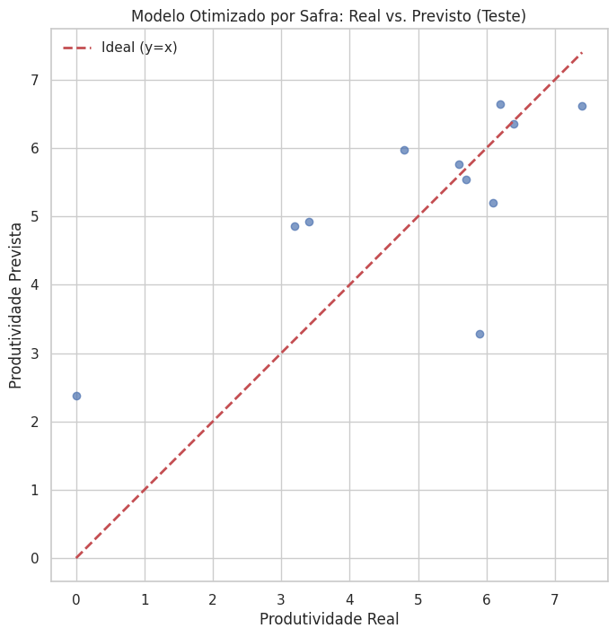
  
   * O gráfico de "Importância das Features" ilustra visualmente a dominância do Ano e a relevância da Umidade e Temperatura Máxima. 
 
 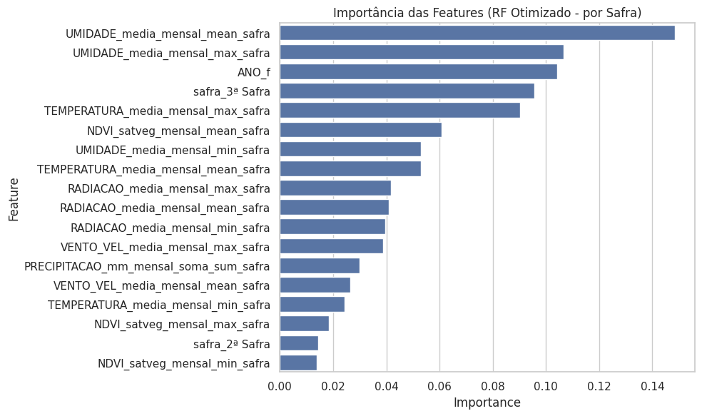

## Conclusões e Próximos Passos

* A agregação dos dados por **safra agrícola** foi crucial para obter um modelo com desempenho preditivo moderado (R² ≈ 0.52).
* O modelo `RandomForestRegressor` otimizado conseguiu capturar parte da relação entre clima/NDVI e produtividade, destacando a importância da **umidade** e da **temperatura máxima** durante o ciclo da safra.
* A forte influência da variável **ANO** sugere que fatores de tendência temporal (tecnologia, genética, manejo geral) não modelados explicitamente ainda são os principais direcionadores da produtividade ao longo do período analisado.
* O erro médio (MAE ≈ 1.07 t/ha) indica que o modelo pode ser útil para estimativas, mas ainda possui limitações para previsões de alta precisão.
  
* **Próximos Passos Recomendados:**
    * **Incorporar Dados de Solo:** Adicionar informações reais sobre tipo de solo, textura, matéria orgânica, etc., acreditamos que esse é o passo mais promissor para melhorar o modelo.
    * **Dados de Manejo:** Incluir dados históricos sobre data de plantio, híbridos utilizados, níveis de adubação e irrigação, enriqueceria significativamente a análise.
    * **Refinar Features:** Experimentar com agregações em períodos fenológicos mais específicos dentro de cada safra.
    * **Testar Outros Modelos:** Avaliar algoritmos como XGBoost ou LightGBM com o conjunto de dados por safra.

## Como Usar o Projeto

1.  **Ambiente:** Recomenda-se usar um ambiente Python com as bibliotecas listadas no arquivo `requirements.txt`.
2.  **Dados:** Coloque os arquivos CSV brutos (`satveg_original.csv`, `serie_historica_graos.csv` e os arquivos `sorriso_YYYY.csv` do INMET) na pasta `dados_originais/`.
3.  **Executar Pré-processamento (Etapa 1):** Execute os notebooks ou scripts Python correspondentes à Etapa 1 para cada fonte de dados (SatVeg, Clima, Milho). Isso gerará os arquivos processados na pasta `dados_processados/`.
4.  **Executar Consolidação e Análise (Etapa 2):** Execute o notebook/script da Etapa 2 para gerar a base consolidada mensal (`base_consolidada_mensal.csv`) e visualizar a análise exploratória.
5.  **Executar Modelagem (Etapa 3):** Execute o notebook/script da Etapa 3 para realizar a agregação por safra, treinar/otimizar o modelo RandomForest e salvar o modelo final (`modelo_final_rf_por_safra_otimizado.joblib`) na pasta `resultados/modelos/`.
6.  **Visualizar Dashboard (Etapa 4):**
    * Certifique-se de que as bibliotecas do `requirements.txt` do Streamlit estejam instaladas (`pip install -r requirements_streamlit.txt` - crie este arquivo se for diferente do principal).
    * Execute o aplicativo Streamlit a partir do terminal: `streamlit run app_produtividade.py`ou diretamente no site [Streamlit](https://streamlit.io/)

**Sobre os entregáveis:**

   **Entregável 1:** É o próprio README e o APP com as principais visualizações [Link para o App Implantado](https://juhungaro-pipoca-app-produtividade-umuvv5.streamlit.app/)
  
   **Entregável 2:** O notebook *Entrega2_V2.ipynb* onde contém todo o código para a Entrega 2, por segurança o código do APP também esta no notebook *app_produtividade* e aplicação do Streamlit esta direcionda pra ele.

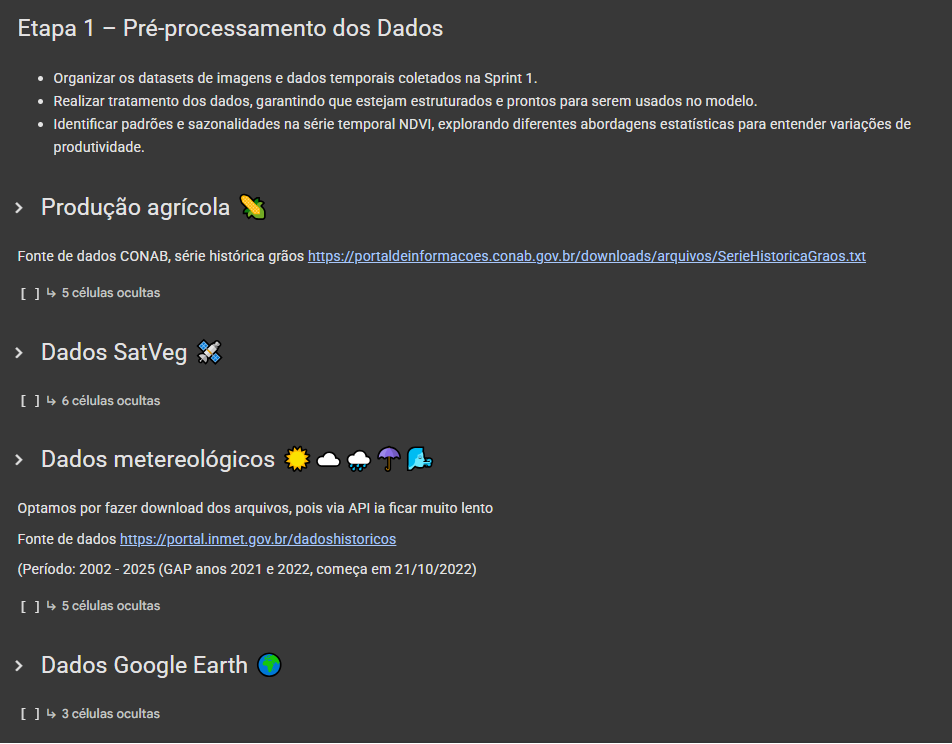

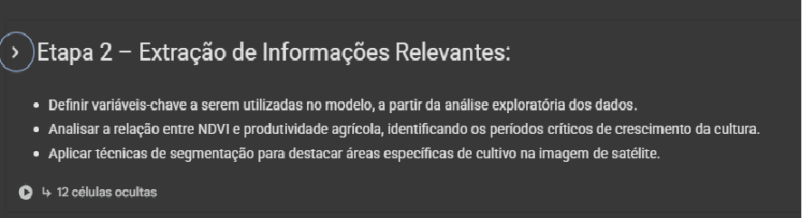

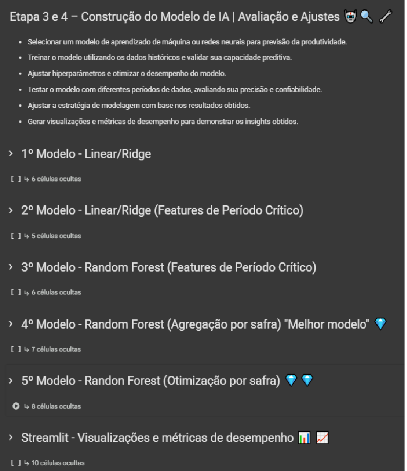

   **Entregável 3:** VIDEO INSERIR LINK

## 📋 Licença

<a property="dct:title" rel="cc:attributionURL" href="https://github.com/agodoi/template">MODELO GIT FIAP</a> por <a rel="cc:attributionURL dct:creator" property="cc:attributionName" href="https://fiap.com.br">Fiap</a> está licenciado sobre <a href="http://creativecommons.org/licenses/by/4.0/?ref=chooser-v1" target="_blank" rel="license noopener noreferrer" style="display:inline-block;">Attribution 4.0 International</a>.

